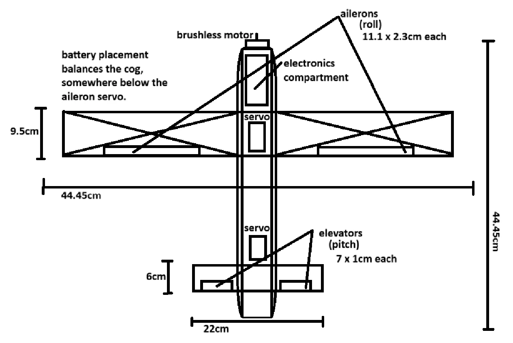

# **GlideRC**
Transforming a 2$ hand-thrown foam glider into an RC Airplane.
  

## Motivation
I recently discovered this foam glider kit on a toy store while I was travelling. As soon as my eyes saw it, I thought "Why not add a motor and make it fly?" and thus, this project was born. Who would've thought it would take this much effort!

## Parts
Available as [BOM.csv](./bom.csv)
> Might change later on, Depending upon prices and availability.

## Schematics
Done in KiCAD: [Schematics folder](./schematics/)

## Firmware
In progress: [Firmware folder](./GlideRC_FC_Firmware/) 
Please see the readme inside the firmware folder for more info on firmware. 

## Airframe
[Sample Foam Glider link](https://www.walmart.com/ip/2-Pack-Glider-Plane-Toys-17-5-Large-Throwing-Foam-Airplane-Dual-Flight-Mode-Flying-Toy-The-Best-Outdoor-Sport-Toy-Gifts-for-Kids/469352630)

 

> "cog" is short for Centre Of Gravity  
> see: https://rcplanes.online/index5.htm

## What currently works?
- Radio Receiver-to-MCU data transfer
- MCU can control the servos (responsible for controlling the aileron and elevator), the brushless motor
- MCU can access IMU data (gyro, accelerometer)

## What is planned?
- Calibration of values that we actually receive from the components / that actually make the components work
- Stabilization of the aircraft when no updates are received from the transmitter using IMU data to get smooth and stable flight

These goals will not be possible without physical possession of the required components, hence will be done after I receive the components.

## Notes for self
- look into connector types for battery discharge (specs say xt90 but im skeptical of that)
- look into battery charging

## Credits
- [Optimunn/mp92plus](https://github.com/Optimunn/mp92plus/): Really cool MPU9250 (MPU6500) driver for Raspberry pi pico (RP2040) using I2C or SPI.
    - [MIT License](https://github.com/Optimunn/mp92plus/blob/main/LICENSE.md)
    - [located here in firmware](./GlideRC_FC_Firmware/libs/mp92plus/).

## References
- https://rcplanes.online/design.htm
- https://rcplanes.online/index2.htm
- https://rcplanes.online/index5.htm
- https://learn.sparkfun.com/tutorials/voltage-dividers/all
- https://forums.raspberrypi.com/viewtopic.php?t=209958
- https://forums.raspberrypi.com/viewtopic.php?t=285083
- https://www.homemade-circuits.com/how-to-make-logic-gates-using-transistors/
- https://talk.dallasmakerspace.org/t/raspberry-pi-pico-sbus-code-help/79375
- https://docs.micropython.org/en/latest/rp2/quickref.html#quick-reference-for-the-rp2
- https://forums.raspberrypi.com/viewtopic.php?t=88572
- https://forum.arduino.cc/t/mpu6500-6dof-spi-not-working/552645/6
- https://www.raspberrypi.com/documentation/microcontrollers/c_sdk.html
- https://pip-assets.raspberrypi.com/categories/610-raspberry-pi-pico/documents/RP-008276-DS-1-getting-started-with-pico.pdf
- https://pip-assets.raspberrypi.com/categories/609-microcontroller-boards/documents/RP-009085-KB-1-raspberry-pi-pico-c-sdk.pdf
- https://uwarg-docs.atlassian.net/wiki/spaces/efs/pages/2238283817/SBUS+Protocol
- https://www.youtube.com/watch?v=IqLUHj7nJhI
- https://www.w3schools.com/c/index.php
- https://forums.raspberrypi.com/viewtopic.php?t=306053
- https://forums.raspberrypi.com/viewtopic.php?t=339740
- https://www.circuitden.com/blog/16
- https://forums.raspberrypi.com/viewtopic.php?t=370038
- https://www.raspberrypi.com/documentation/pico-sdk/hardware.html#group_hardware_pwm_1pwm_example
- https://www.kpower.com/insight_driver/7471.html/
- https://www.hackster.io/milkgolium/controlling-a-pwm-brushless-esc-with-raspberry-pi-pico-b2d4bb
- https://forums.raspberrypi.com/viewtopic.php?t=320933
- https://github.com/micropython/micropython/blob/d42cba0d22cac812cc5a12f4670010b45932eafa/ports/rp2/machine_spi.c#L42-L46
