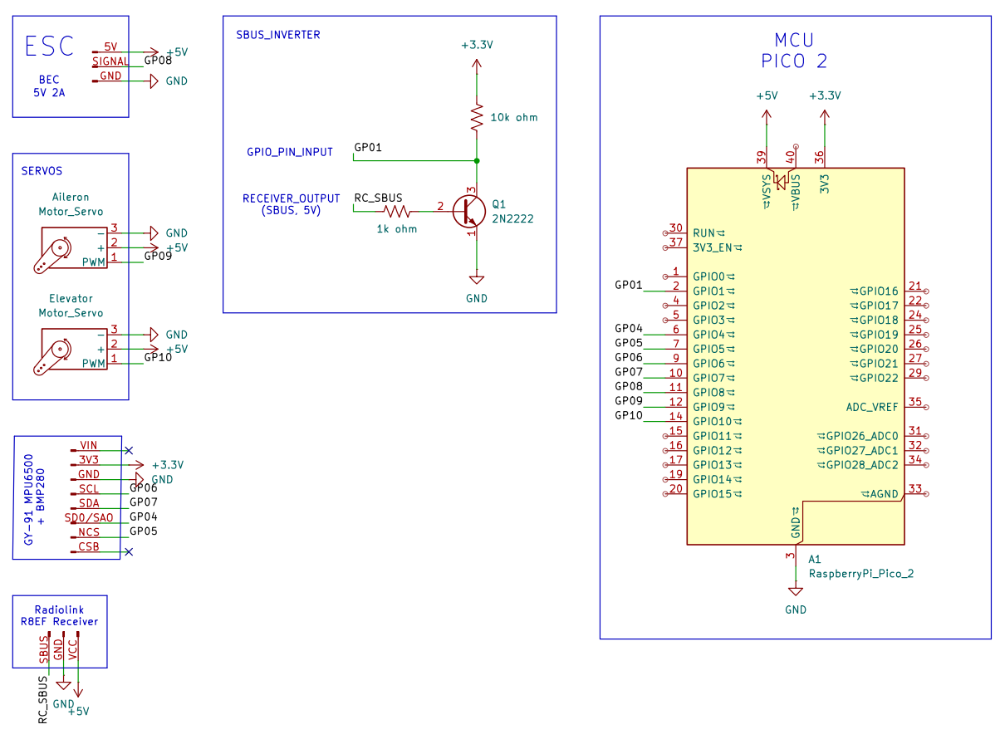

# **GlideRC**
Transforming a 2$ hand-thrown foam glider into an RC Airplane.
  

## Parts
Mentioned in the [BOM](./bom.csv)
> Might change later on depending upon prices and availability

## Schematics
Done in KiCAD: [Project folder](./schematics/)

## Firmware
In progress: [Firmware folder](./GlideRC_FC_Firmware/)

## Airframe
[Sample Foam Glider](https://www.walmart.com/ip/2-Pack-Glider-Plane-Toys-17-5-Large-Throwing-Foam-Airplane-Dual-Flight-Mode-Flying-Toy-The-Best-Outdoor-Sport-Toy-Gifts-for-Kids/469352630)

## Notes for self
- look into connector types for battery discharge (specs say xt90 but im skeptical of that)
- look into battery charging

## Credits / References
- https://rcplanes.online/design.htm
- https://learn.sparkfun.com/tutorials/voltage-dividers/all
- https://forums.raspberrypi.com/viewtopic.php?t=209958
- https://forums.raspberrypi.com/viewtopic.php?t=285083
- https://www.homemade-circuits.com/how-to-make-logic-gates-using-transistors/
- https://talk.dallasmakerspace.org/t/raspberry-pi-pico-sbus-code-help/79375
- https://docs.micropython.org/en/latest/rp2/quickref.html#quick-reference-for-the-rp2
- https://forums.raspberrypi.com/viewtopic.php?t=88572
- https://forum.arduino.cc/t/mpu6500-6dof-spi-not-working/552645/6
- https://www.raspberrypi.com/documentation/microcontrollers/c_sdk.html
- https://pip-assets.raspberrypi.com/categories/610-raspberry-pi-pico/documents/RP-008276-DS-1-getting-started-with-pico.pdf
- https://pip-assets.raspberrypi.com/categories/609-microcontroller-boards/documents/RP-009085-KB-1-raspberry-pi-pico-c-sdk.pdf
- https://uwarg-docs.atlassian.net/wiki/spaces/efs/pages/2238283817/SBUS+Protocol
- https://www.youtube.com/watch?v=IqLUHj7nJhI
- https://www.w3schools.com/c/index.php
- https://forums.raspberrypi.com/viewtopic.php?t=306053
- https://forums.raspberrypi.com/viewtopic.php?t=339740
- https://www.circuitden.com/blog/16
- https://forums.raspberrypi.com/viewtopic.php?t=370038
- https://www.raspberrypi.com/documentation/pico-sdk/hardware.html#group_hardware_pwm_1pwm_example
- https://www.kpower.com/insight_driver/7471.html/
- https://www.hackster.io/milkgolium/controlling-a-pwm-brushless-esc-with-raspberry-pi-pico-b2d4bb